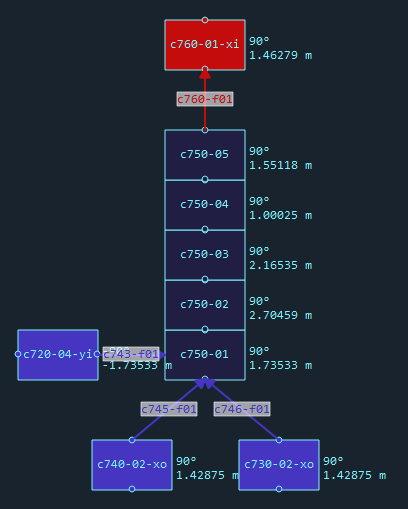
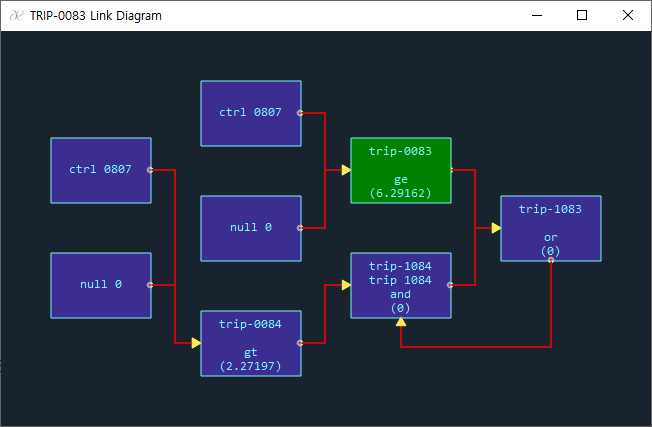
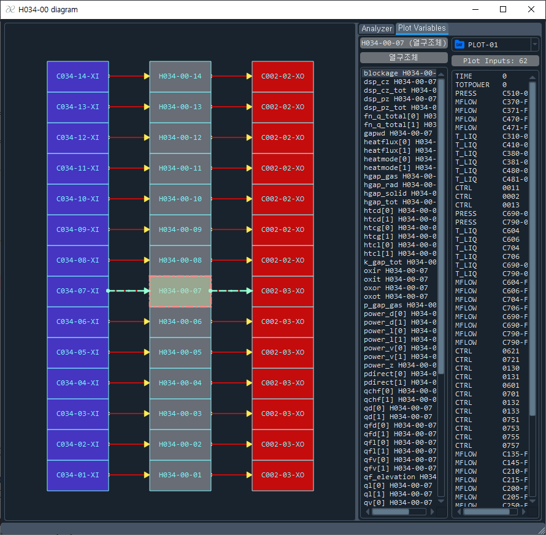

# What is AESPA?
AESPA is the Advanced Editor for SPACE Problem Analysis. It is developed based on C++ language and Qt framework.
The AESPA supports many helpful functions to assist the users of SPACE code as follows:

## Text edit
AESPA can be used as a typical text editor. It means that AESPA supports many functions like normal text editors.

## SPACE input categorization
If you open and load a SPACE input file without a syntax error, AESPA detects SPACE components automatically. And they are displayed in the component tree. Users can navigate the input by selecting a tree item.

## Automatic generation of various diagram
AESPA can generate the various component diagram such as BRCH, CELL, PIPE, FACE, MFACE, TFBC, PUMP, VALV, SEPR, TABL, TRIP, CTRL, etc. The following image shows the diagram of C260 BRCH and connected components. You can navigate the corresponding input line by clicking a node you want to know the detail input values.

The following image shows the TRIP diagram and connected components. TRIP diagram always shows the whole map containing the user-select node. The green color node is the node that user selects by mouse. 

## Heat structure node diamgram and adding a plot variable
The following image shows the heat structure diagram. You can add a plot variable to your input file directly on it by double clicks or drag-and-drop.

# Releases
+ Date Released 2024. 11. 14 Download [ Version 1.0.3 ](https://drive.google.com/file/d/1vXq0dvgXD7xbTDdZEQnQXNDap5c4AIjS/view?usp=sharing)
  + Enhanced function to manage plot inputs
  + Function to click the plot hot spot. Click the "PLOT" on the PLOT-XX-YYY.
+ Date Released 2024. 11. 05 Download [ Version 1.0.2 ](https://drive.google.com/file/d/1DubzX8gTwICGdiLBE2SXdiEpHqJVotAY/view?usp=sharing)
  + Heat structure node diagram
  + Adding a plot variable input on the node diagram
+ Date Released 2024. 11. 05 Download [ Version 1.0.1 ](https://drive.google.com/file/d/1pTk2VpUOksSNifmW_nVthZHaK9Pe9U16/view?usp=sharing)
  + Batch job function added
+ Date Released 2024. 11. 02 Download [ Version 1.0.0 ](https://drive.google.com/file/d/1Rt_rMqpUtkScqccwkQXaX7Sc8qnSlHHx/view?usp=sharing)
+ Version 2.0.0 is under construction.

# User's Manual
+ [ Draft Version ](https://drive.google.com/file/d/1BsKAnH19HjmRuj5R1_JQriM_sxqikglF/view?usp=sharing)
