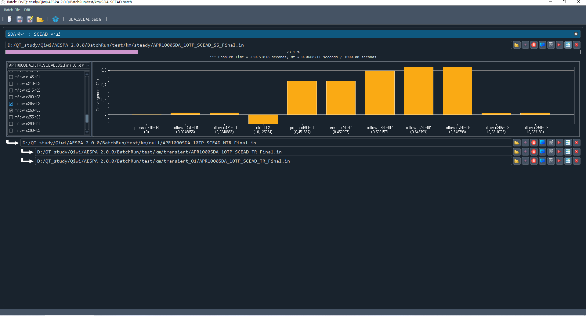

# What is AESPA?
AESPA is the Advanced Editor for SPACE Problem Analysis. It is developed based on C++ language and Qt framework.
The AESPA supports many helpful functions to assist the users of SPACE code as follows:

## Text edit
AESPA can be used as a typical text editor. It means that AESPA supports many functions like normal text editors.

## SPACE input categorization
If you open and load a SPACE input file without a syntax error, AESPA detects SPACE components automatically. And they are displayed in the component tree. Users can navigate the input by selecting a tree item.

## Automatic generation of various diagram
AESPA can generate the various component diagram such as BRCH, CELL, PIPE, FACE, MFACE, TFBC, PUMP, VALV, SEPR, HSTS, PLOT, TABL, TRIP, CTRL, etc. The following image shows the diagram of C750 PIPE and connected components. You can navigate the corresponding input line by clicking a node you want to know the detail input values.

The following image shows the TRIP diagram and connected components. TRIP diagram always shows the whole map containing the user-select node. The green color node is the node that user selects by mouse.

## Heat structure node diamgram and adding a plot variable
The following image shows the heat structure diagram. You can add a plot variable to your input file directly on it by double clicks or drag-and-drop.

## Showing and comparing overriden inputs
SPACE inputs can be overriden multiple times. When it happens, it will make the users uncomportable. They will be confused which input is a final version.
To avoid these complains, AESPA provides a function to show and compare overriden inputs. The following image is a example:

## One Case Run with Real-time plots
To develop the SPACE basedeck of some problem, users may execute SPACE  many times with same input again and again. For these situations, AESPA supports one case run with real-time plots. The following image shows a example:

## Batch Run
Typically, SPACE calculations consist of multiple steps. The first step will be a steady-state calculation to produce restart files. The next step will be
a transient calculation or another steady-state calculation. That is, the calculations are connected each other. AESPA can perform these multiple calculations
automatically. Users just prepare the right inputs for AESPA in the batch run mode. While calculating, users can watch the convergences of all variables in the Plot data files in real time. The following image shows a example:

# Releases

+ Date Released 2025. 3. 1 Download [ Version 1.0.4 ](https://drive.google.com/file/d/1Y9ZN_7W3QHxCAUD5Qn6-0i50ZWsrX7XQ/view?usp=sharing)
  + Fix a few bugs
  + Showing fancy overriden inputs
  + Enhancing plotting GUI
  + Enhancing batch run interface
  + Implementing the multi-processing of SPACE calculations in a batch run mode
  + Add convergence checking function in online or offline modes.
  + Enhancing one case run window to use real-time plots
+ Date Released 2024. 12. 08 Download [ Version 1.0.3 ](https://drive.google.com/file/d/1zSuLqO688KfUx7qPOYmOAsUkbvmb9wmz/view?usp=sharing)
  + Enhanced function to manage plot inputs
  + Function to click the plot hot spot. Click the "PLOT" on the PLOT-XX-YYY
  + Fixed number of bugs and errors
  + Function to organize check sums
  + Function to organize the component tree using a output file
+ Date Released 2024. 11. 05 Download [ Version 1.0.2 ](https://drive.google.com/file/d/1DubzX8gTwICGdiLBE2SXdiEpHqJVotAY/view?usp=sharing)
  + Heat structure node diagram
  + Adding a plot variable input on the node diagram
+ Date Released 2024. 11. 05 Download [ Version 1.0.1 ](https://drive.google.com/file/d/1pTk2VpUOksSNifmW_nVthZHaK9Pe9U16/view?usp=sharing)
  + Batch job function added
+ Date Released 2024. 11. 02 Download [ Version 1.0.0 ](https://drive.google.com/file/d/1Rt_rMqpUtkScqccwkQXaX7Sc8qnSlHHx/view?usp=sharing)
+ Version 2.0.0 is under construction.

# User's Manual
+ [ Draft Version ](https://drive.google.com/file/d/1BsKAnH19HjmRuj5R1_JQriM_sxqikglF/view?usp=sharing)
