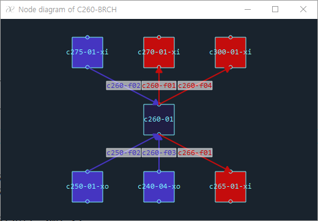

# What is AESPA?
AESPA is the Advanced Editor for SPACE Problem Analysis. It is developed based on C++ language and Qt framework.
The AESPA supports many helpful functions to assist the users of SPACE code as follows:

## Text edit
AESPA can be used as a typical text editor. It means that AESPA supports many functions like normal text editors.

## SPACE input categorization
If you open and load a SPACE input file without a syntax error, AESPA detects SPACE components automatically. And they are displayed in the component tree. Users can navigate the input by selecting a tree item.

## Automatic generation of various diagram
AESPA can generate various digram which shows relation between the connected components each other. For example, the following image shows a relation of the BRCH C260 and the connected components. By clicking a node on the diagram, you can go to the corresponding input line very fast.

# Releases
+ Download [ Version 1.0.0 ](https://drive.google.com/file/d/1h2RvJOmhqxlrBqqUk1k9eLe5QBNOqjJd/view?usp=sharing)
+ Version 2.0.0 is under construction.

# User's Manual
+ [ Draft Version ](https://drive.google.com/file/d/1BsKAnH19HjmRuj5R1_JQriM_sxqikglF/view?usp=sharing)
