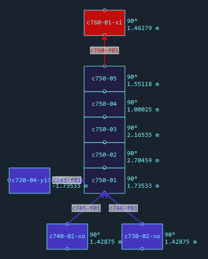
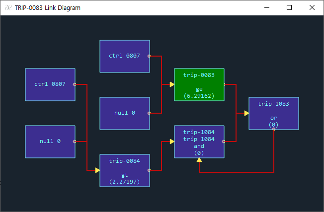
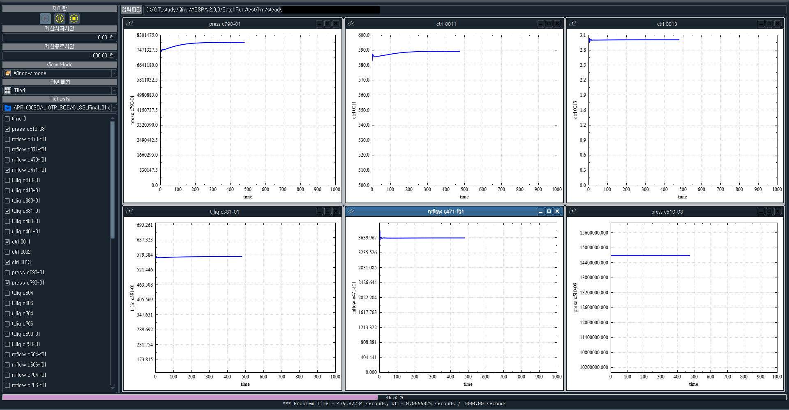

# What is AESPA?
AESPA is the Advanced Editor for SPACE Problem Analysis. It is developed based on C++ language and Qt framework. You can watch the awesome movies of AESPA demos at the following YouTube channels:

## User's Manual
+ [ Latest Version ](https://drive.google.com/file/d/1U-Tpfg-efNa_Ke6hGKIWjlLx29x8Y4e3/view?usp=sharing)

## Download AESPA (2026. 7. 4.)
+ [Latest Version ](https://drive.google.com/file/d/1bkIklcjXgIuiwuDZ9mbyupk1IdUNvaoa/view?usp=sharing)

The AESPA supports many helpful functions to assist the users of SPACE code as follows:

## Text edit
AESPA can be used as a typical text editor. It means that AESPA supports many functions like normal text editors.

## SPACE input categorization
If you open and load a SPACE input file without a syntax error, AESPA detects SPACE components automatically. And they are displayed in the component tree. Users can navigate the input by clicking a tree item or moving selection by Up-and-Down key. The component tree will show the final input not the overriden inputs. The example tree is shown below:

## Input Syntax Checker
You can check the syntax of the SPACE input before and after the code execution. If your input had any syntax errors like no existence of component, AESPA can trace it and show it below the related input line. The following image is the example:

## Automatic generation of various diagram
AESPA can generate the various component diagram such as BRCH, CELL, PIPE, FACE, MFACE, TFBC, PUMP, VALV, SEPR, HSTS, PLOT, TABL, TRIP, CTRL, etc. The following image shows the diagram of C750 PIPE and connected components. You can navigate the corresponding input line by clicking a node you want to know the detail input values.

The following image shows the TRIP diagram and connected components. TRIP diagram always shows the whole map containing the user-select node. The green color node is the node that user selects by mouse.

## Heat structure node diamgram and adding a plot variable
The following image shows the heat structure diagram. You can add a plot variable to your input file directly on it by double clicks or drag-and-drop.

## Showing and comparing overriden inputs
SPACE inputs can be overriden multiple times. When it happens, it will make the users uncomportable. They will be confused which input is a final version.
To avoid these complains, AESPA provides a function to show and compare overriden inputs. The following image is an example:

## One Case Run with Real-time plots
To develop the SPACE basedeck of some problem, users may execute SPACE  many times with same input again and again. For these situations, AESPA supports one case run with real-time plots. The following image shows an example:

## Batch Run
Typically, SPACE calculations consist of multiple steps. The first step will be a steady-state calculation to produce restart files. The next step will be
a transient calculation or another steady-state calculation. That is, the calculations are connected each other. AESPA can perform these multiple calculations
automatically. Users just prepare the right inputs for AESPA in the batch run mode. While calculating, users can look over the convergences of all the variables in the Plot data files. The following image shows an example:

## Automatic SPACE Nodal Creation from the text input
SPACE input is too complicated to see the overall structures. It has many faces to connect the components such as CELL, BRCH, PIPE, etc. It is really hard to draw the nodal diagram by hands. From now on, AESPA provides the automatic nodal creation from your text SPACE input file. The nodal creation happens in the very short time. You don't need to put the useless efforts to draw the nodal diagram correctly. The example nodal diagram of Edward's pipe is shown below:

For the complete system model :

## Heat Map
AESPA can draw the heat map of a plot variable on the nodal diagram generated by AESPA. For example, the t_liq heat map is generated with above system model. It is shown as follows:

# Release Notes
+ Date Released 2026. 7. 4
  + Adding more functionals of heat map
  + Making UI more visible
+ Date Released 2026. 6. 21
  + Generating Heat map of a plot variables on nodal diagram created by AESPA
  + Fix a few bugs
+ Date Released 2026. 6. 3
  + Add nodal creation from the SPACE text input file
  + Fix a few bugs
+ Date Released 2026. 3. 12
  + Enhance the file load and save features
  + Upgrading drag-n-drop the file
  + Fix a few bugs
+ Date Released 2026. 3. 1
  + Fix display resolution problem
  + Fix cursor position bug after saving the file
  + On-click manual in English
  + Add function to lock and unlock file, exclusively
  + Add function to remove the blank lines
  + Add function to remove trailing blanks at the end of line
  + Fix bugs in comparing files
+ Date Released 2025. 7. 23
  + Fix drag and drop functionality
  + Fix hangul character bugs in descriptions
  + Showing fancy overriden inputs
  + Enhancing plotting GUI
  + Enhancing batch run interface
  + Implementing the multi-processing of SPACE calculations in a batch run mode
  + Add convergence checking function in online or offline modes.
  + Enhancing one case run window to use real-time plots
+ Date Released 2024. 12. 08
  + Enhanced function to manage plot inputs
  + Function to click the plot hot spot. Click the "PLOT" on the PLOT-XX-YYY
  + Fixed number of bugs and errors
  + Function to organize check sums
  + Function to organize the component tree using a output file
+ Date Released 2024. 11. 05
  + Heat structure node diagram
  + Adding a plot variable input on the node diagram
+ Date Released 2024. 11. 05
  + Batch job function added
+ Date Released 2024. 11. 02
+ Version 2.0.0 is under construction.
